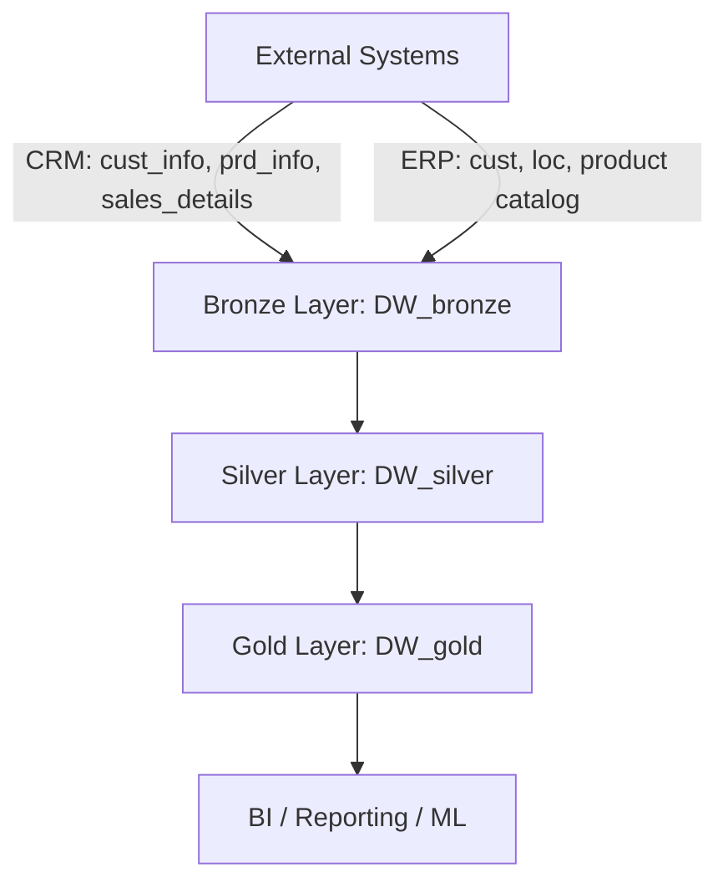

📊 SQL Warehouse – Medallion Architecture (Bronze, Silver, Gold)
Overview

This repository contains the SQL Warehouse implementation for ingesting, processing, and serving data using a Medallion Architecture approach (Bronze → Silver → Gold).
The warehouse is built on Google Cloud Platform (GCP) using BigQuery, Cloud Storage, and optional orchestration tools like Airflow (Composer).

The pipeline is designed for industry-scale data engineering practices, with automation, version control, and monitoring in mind.

🏗️ Architecture




---

### **2️⃣ Folder Structure (Mermaid Tree)**
```markdown
data-warehouse/
├── bronze/
│   ├── ddl/                  # Table creation scripts
│   ├── procedures/           # Stored procedures for data ingestion
│   └── readme.md
├── silver/
│   ├── transformations/      # SQL transformations for cleaning & enrichment
│   └── views/                # Intermediate views
├── gold/
│   ├── marts/                # Aggregated / analytics-ready tables
├── orchestration/
│   └── airflow_dags/         # DAGs for automating ETL pipelines
└── README.md                 # Main project overview
```

🥉 Bronze Layer

Purpose: Ingest raw CSV files from CRM and ERP into BigQuery.
Key Elements:

Stored Procedure: sp_load_bronze_data

Tables: crm_cust_info, crm_prd_info, crm_sales_details, erp_cust_az12, erp_loc_a101, erp_px_cat_g1v2

Source Files: Located in gs://bronze_layer_data/

Execution:

CALL `sql-warehouse-nov25.DW_bronze.sp_load_bronze_data`();


Documentation: See bronze/readme.md for detailed file descriptions and GCS locations.

## 🥈 Silver Layer

Purpose: Clean, normalize, and validate data from Bronze layer.
Key Elements:

Remove duplicates and inconsistent rows

Convert data types and standardize formats

Generate intermediary tables ready for aggregation

Tools: BigQuery SQL, dbt (optional), Airflow for scheduling

## 🥇 Gold Layer

Purpose: Analytics-ready tables for reporting, dashboards, and ML pipelines.
Key Elements:

Aggregated KPIs (sales totals, customer counts, product metrics)

Fact and dimension tables for BI tools

Optimized for query performance

Consumption: Looker, Tableau, Power BI, or APIs

## ⚙️ Orchestration & Automation

Cloud Composer / Airflow: Orchestrates Bronze → Silver → Gold pipelines

BigQuery Scheduled Queries: Can run procedures and transformation queries automatically

CI/CD Deployment:

SQL files and procedures are version-controlled in Git

Deployment via bq query --use_legacy_sql=false < file.sql

## 🔧 Prerequisites

GCP Project: sql-warehouse-nov25

Datasets: DW_bronze, DW_silver, DW_gold

Cloud Storage Bucket: gs://bronze_layer_data/ (CSV landing zone)

Service Account Permissions:

roles/bigquery.dataEditor

roles/storage.objectViewer

## 📝 Contribution Guidelines

Store all SQL scripts in their respective layer folders (bronze/, silver/, gold/)

Document each procedure, transformation, and table in README.md

Use Git for version control and code review before deployment

Automate execution via Airflow DAGs or BigQuery Scheduler wherever possible

##📧 Author

Sachin Kaushik
Toronto, ON
